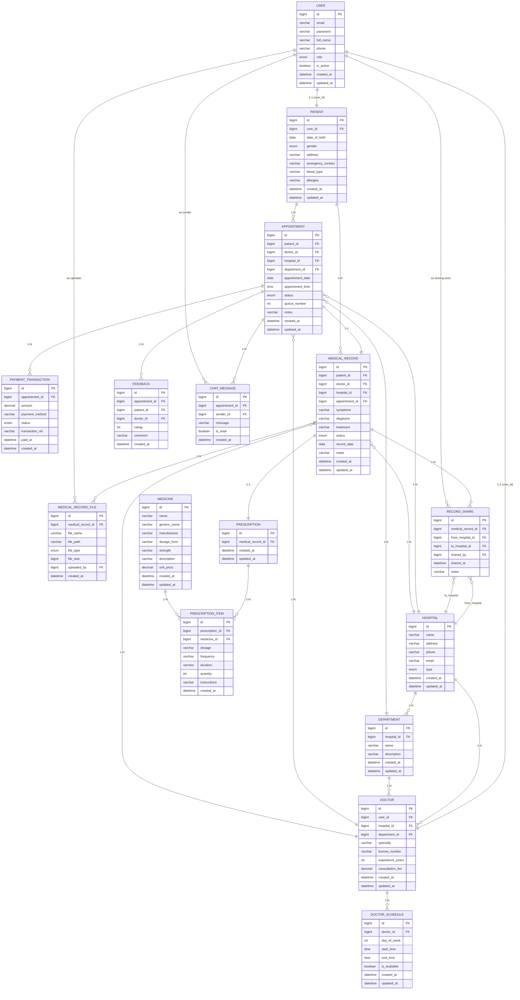

# ERD (Entity Relationship Diagram) - CHRMS

Sơ đồ dưới đây mô tả các bảng chính và quan hệ của hệ thống. Các tên trường sử dụng snake_case để phản ánh khóa ngoại/khóa chính trong cơ sở dữ liệu.

```mermaid
erDiagram
    USER {
        bigint id PK
        varchar email
        varchar password
        varchar full_name
        varchar phone
        enum role
        boolean is_active
        datetime created_at
        datetime updated_at
    }

    PATIENT {
        bigint id PK
        bigint user_id FK
        date date_of_birth
        enum gender
        varchar address
        varchar emergency_contact
        varchar blood_type
        varchar allergies
        datetime created_at
        datetime updated_at
    }

    DOCTOR {
        bigint id PK
        bigint user_id FK
        bigint hospital_id FK
        bigint department_id FK
        varchar specialty
        varchar license_number
        int experience_years
        decimal consultation_fee
        datetime created_at
        datetime updated_at
    }

    HOSPITAL {
        bigint id PK
        varchar name
        varchar address
        varchar phone
        varchar email
        enum type
        datetime created_at
        datetime updated_at
    }

    DEPARTMENT {
        bigint id PK
        bigint hospital_id FK
        varchar name
        varchar description
        datetime created_at
        datetime updated_at
    }

    DOCTOR_SCHEDULE {
        bigint id PK
        bigint doctor_id FK
        int day_of_week
        time start_time
        time end_time
        boolean is_available
        datetime created_at
        datetime updated_at
    }

    APPOINTMENT {
        bigint id PK
        bigint patient_id FK
        bigint doctor_id FK
        bigint hospital_id FK
        bigint department_id FK
        date appointment_date
        time appointment_time
        enum status
        int queue_number
        varchar notes
        datetime created_at
        datetime updated_at
    }

    PAYMENT_TRANSACTION {
        bigint id PK
        bigint appointment_id FK
        decimal amount
        varchar payment_method
        enum status
        varchar transaction_ref
        datetime paid_at
        datetime created_at
    }

    MEDICAL_RECORD {
        bigint id PK
        bigint patient_id FK
        bigint doctor_id FK
        bigint hospital_id FK
        bigint appointment_id FK
        varchar symptoms
        varchar diagnosis
        varchar treatment
        enum status
        date record_date
        varchar notes
        datetime created_at
        datetime updated_at
    }

    MEDICAL_RECORD_FILE {
        bigint id PK
        bigint medical_record_id FK
        varchar file_name
        varchar file_path
        enum file_type
        bigint file_size
        bigint uploaded_by FK
        datetime created_at
    }

    PRESCRIPTION {
        bigint id PK
        bigint medical_record_id FK
        datetime created_at
        datetime updated_at
    }

    PRESCRIPTION_ITEM {
        bigint id PK
        bigint prescription_id FK
        bigint medicine_id FK
        varchar dosage
        varchar frequency
        varchar duration
        int quantity
        varchar instructions
        datetime created_at
    }

    MEDICINE {
        bigint id PK
        varchar name
        varchar generic_name
        varchar manufacturer
        varchar dosage_form
        varchar strength
        varchar description
        decimal unit_price
        datetime created_at
        datetime updated_at
    }

    FEEDBACK {
        bigint id PK
        bigint appointment_id FK
        bigint patient_id FK
        bigint doctor_id FK
        int rating
        varchar comment
        datetime created_at
    }

    CHAT_MESSAGE {
        bigint id PK
        bigint appointment_id FK
        bigint sender_id FK
        varchar message
        boolean is_read
        datetime created_at
    }

    RECORD_SHARE {
        bigint id PK
        bigint medical_record_id FK
        bigint from_hospital_id FK
        bigint to_hospital_id FK
        bigint shared_by FK
        datetime shared_at
        varchar notes
    }

    USER ||--|| PATIENT : "1-1 (user_id)"
    USER ||--|| DOCTOR : "1-1 (user_id)"
    HOSPITAL ||--o{ DEPARTMENT : "1-N"
    HOSPITAL ||--o{ DOCTOR : "1-N"
    DEPARTMENT ||--o{ DOCTOR : "1-N"
    DOCTOR ||--o{ DOCTOR_SCHEDULE : "1-N"
    PATIENT ||--o{ APPOINTMENT : "1-N"
    DOCTOR ||--o{ APPOINTMENT : "1-N"
    HOSPITAL ||--o{ APPOINTMENT : "1-N"
    DEPARTMENT ||--o{ APPOINTMENT : "1-N"
    APPOINTMENT ||--o{ PAYMENT_TRANSACTION : "1-N"
    APPOINTMENT ||--o{ CHAT_MESSAGE : "1-N"
    APPOINTMENT ||--o{ FEEDBACK : "1-N"
    APPOINTMENT ||--|| MEDICAL_RECORD : "1-1"
    PATIENT ||--o{ MEDICAL_RECORD : "1-N"
    DOCTOR ||--o{ MEDICAL_RECORD : "1-N"
    HOSPITAL ||--o{ MEDICAL_RECORD : "1-N"
    MEDICAL_RECORD ||--o{ MEDICAL_RECORD_FILE : "1-N"
    MEDICAL_RECORD ||--|| PRESCRIPTION : "1-1"
    PRESCRIPTION ||--o{ PRESCRIPTION_ITEM : "1-N"
    MEDICINE ||--o{ PRESCRIPTION_ITEM : "1-N"
    MEDICAL_RECORD ||--o{ RECORD_SHARE : "1-N"
    RECORD_SHARE }o--|| HOSPITAL : "from_hospital"
    RECORD_SHARE }o--|| HOSPITAL : "to_hospital"
    USER ||--o{ CHAT_MESSAGE : "as sender"
    USER ||--o{ MEDICAL_RECORD_FILE : "as uploader"
    USER ||--o{ RECORD_SHARE : "as sharing actor"
```
